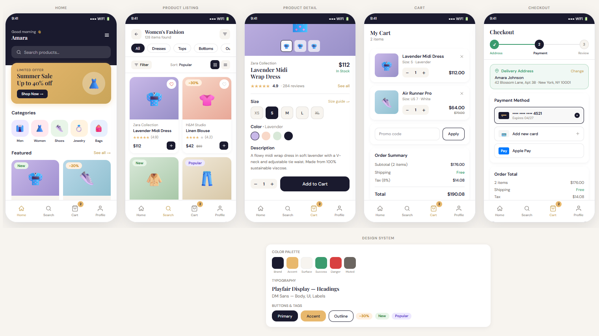
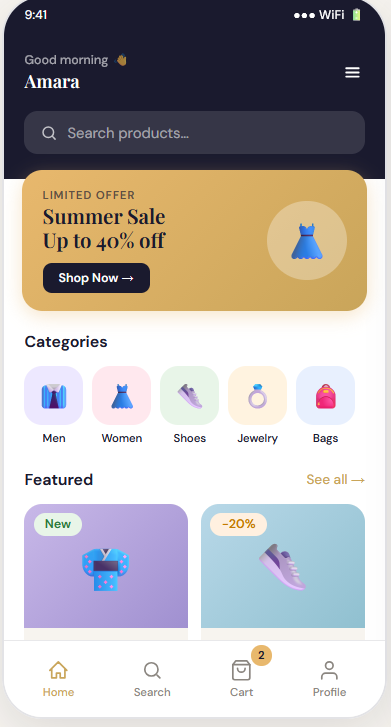
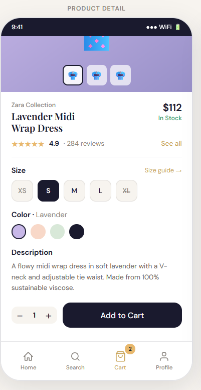
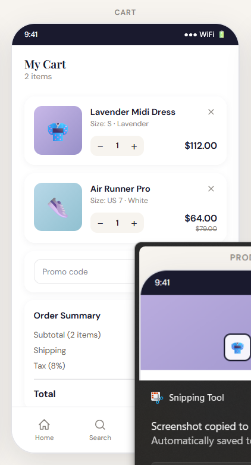
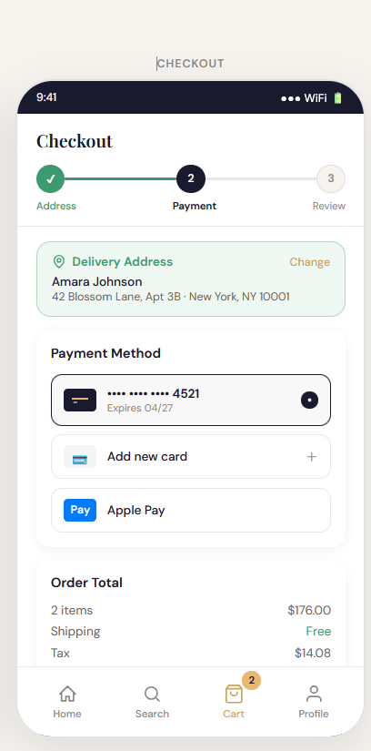
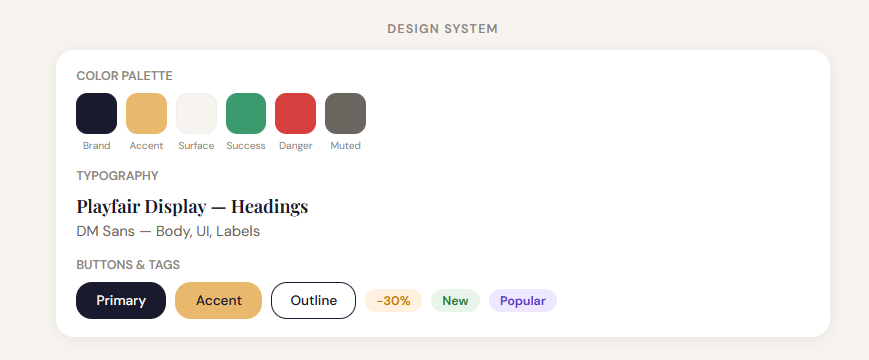

# E-Commerce Mobile UI Design 📱🛒

A modern and user-friendly mobile UI design for an e-commerce application, focused on clean layout, intuitive navigation, and engaging user experience.

---

## 🚀 Features

* Clean and minimal mobile interface
* Product listing and category browsing
* Detailed product view design
* Shopping cart and checkout flow
* Promotional banners and deals section
* Consistent design system (colors, typography, components)

---

## 🎨 Design Highlights

* Mobile-first design approach
* Modern card-based UI layout
* Smooth visual hierarchy and spacing
* User-friendly navigation and interactions
* Consistent color palette and typography

---

## 🛠️ Technologies Used

* HTML
* CSS

---

## 📸 UI Preview

---

## 🏠 Home Screen

---

## 🛍️ Product Listing

---

## 📦 Product Detail

---

## 🛒 Cart

---

## 💳 Checkout

---

## 🎨 Design System

---

## 📌 Project Overview

This project demonstrates my ability to design intuitive and visually appealing user interfaces for real-world applications. It focuses on creating a seamless user journey from browsing products to completing a purchase.

---

## 🎯 Key Skills Demonstrated

* UI/UX Design Principles
* Responsive Layout Design
* Visual Hierarchy & Spacing
* Component-Based Design
* User-Centered Design Thinking

---

## ⚠️ Note

This project is focused on UI/UX design and frontend structure. It does not include backend functionality or real payment integration.

---

## 👨‍💻 Author

**Sharat S Unnithan**
